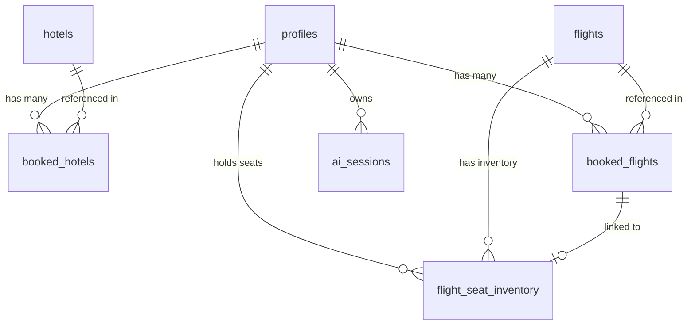

# SKYNORA TRAVELS — MongoDB to Supabase PostgreSQL Migration Plan

This document outlines the detailed strategy and audit findings for migrating the backend database layer of **SKYNORA TRAVELS** from MongoDB to Supabase PostgreSQL while preserving all existing frontend UI and backend API capabilities.

---

## A. Current Architecture Overview

The application is structured as a two-tier full-stack architecture:

- **Frontend**: React 17, Redux Toolkit, Material UI (MUI v5), CSS Modules, React Router v6.
- **Backend**: Node.js, ExpressJS v4, Mongoose (MongoDB ODM), JWT authentication, Bcrypt password hashing, Twilio OTP integration, Duffel Air API, Anthropic AI integration.
- **Database**: MongoDB (local or MongoDB Atlas connection via `MONGOOSE_DB_URL`).

---

## B. Discovered MongoDB Collections & Mongoose Models

| Collection Name | Model Location | Purpose & Main Fields |
|---|---|---|
| `users` | `backend/models/User.js` | User credentials & profile data (`name`, `email`, `password`, `phone`, `mobile_number`, `refreshTokens`, `preferences`, `savedItineraries`) |
| `hotels` | `backend/models/hotels.model.js` | Hotel catalog listings (`name`, `ratings`, `location`, `country`, `price`, `cover`, `extraimageUrl`) |
| `flights` | `backend/schema/flightSchema/flightSchema.js` | Flight catalog listings (`name`, `departure_time`, `arrival_time`, `duration`, `fare`, `stops`, `departure`, `arrival`, `flight_details`) |
| `allBookedFlights` | `backend/models/AllBookedFlights.js` | Flight bookings made by users (`user`, `flight`, `name`, `departure_time`, `arrival_time`, `duration`, `fare`, `stops`, `departure`, `arrival`, `seatNumber`, `travelDate`, `bookingStatus`) |
| `allBookedHotels` | `backend/models/AllBookedHotels.js` | Hotel bookings made by users (`user`, `name`, `location`, `country`, `price`, `cover`) |
| `flightseatinventories` | `backend/models/FlightSeatInventory.js` | Seat allocation & hold transactions (`flight`, `travelDate`, `seatNumber`, `status`, `heldBy`, `holdExpiresAt`, `booking`) |
| `sessions` | `backend/models/Session.js` | AI Travel Assistant conversation sessions & tool logs (`userId`, `constraints`, `tripPlan`, `messages`, `toolCallLog`, `metadata`) |

---

## C. Backend APIs Using Each Collection

### 1. `users`
- `POST /auth/register` — Creates user account with hashed password.
- `POST /auth/login` — Authenticates user by email/phone/mobile_number and password.
- `GET /auth/me` & `GET /auth/getuser` — Retrieves authenticated user profile.
- `PUT /auth/edituser` — Updates profile info (`name`, `phone`, `email`).
- `POST /auth/refresh` — Verifies refresh token against user's stored refresh tokens array.
- `POST /auth/logout` — Revokes refresh token.
- `POST /auth/otplogin` & `POST /auth/otpverify` — OTP authentication via Twilio.

### 2. `hotels`
- `GET /hotels` — Retrieves catalog of hotels.
- `GET /hotels/:id` — Retrieves specific hotel details by ID.

### 3. `flights`
- `GET /flights` — Retrieves flight catalog.
- `GET /flights/:id` — Retrieves single flight by ID.
- `POST /flights` — Inserts new flight catalog entry.
- `GET /flights/:flightId/seats` — Fetches seat map status for a given flight and travel date.

### 4. `allBookedFlights` & `flightseatinventories`
- `GET /bookings/flights` — Lists flight bookings for authenticated user.
- `GET /bookings/flights/:bookingId` — Fetches single flight booking by ID.
- `POST /bookings/flights` — Direct flight booking creation.
- `POST /bookings/flight/hold-seat` — Reserves/holds a seat for 10 minutes (handles concurrency).
- `POST /bookings/flight/confirm` — Confirms seat hold into a confirmed booking.
- `DELETE /bookings/flights/:bookingId` — Cancels flight booking and releases seat.

### 5. `allBookedHotels`
- `GET /bookings/hotels` — Lists hotel bookings for authenticated user.
- `GET /bookings/hotels/:bookingId` — Fetches single hotel booking by ID.
- `POST /bookings/hotels` — Creates a hotel booking.
- `DELETE /bookings/hotels/:bookingId` — Cancels hotel booking.

### 6. `sessions`
- `POST /ai/chat` — AI Travel assistant endpoint for managing session history.
- `POST /ai/session/new` — Starts a new AI session.
- `GET /ai/session/:id` & `GET /ai/sessions` — Retrieves session data.
- `DELETE /ai/session/:id` — Clears/abandons AI session.

---

## D. Frontend Features Depending on Backend APIs

| Frontend Component / Slice | Dependent Endpoints | UI Feature |
|---|---|---|
| `Login.jsx` & `Registration.jsx` | `/auth/login`, `/auth/register`, `/auth/otplogin`, `/auth/otpverify`, `/auth/me` | Authentication modal, Login, Sign Up, OTP |
| `Profile.jsx` | `/auth/me`, `/auth/edituser`, `/auth/logout` | View & Edit personal profile info |
| `Flight.jsx`, `SingleFlight.jsx`, `flightSlice.js` | `/flights` | Search, sort, and filter available flights |
| `ProductPage.jsx`, `Hotels.jsx`, `hotelSlice.js` | `/hotels` | Search, sort, and filter hotel catalog |
| `FlightPayment.jsx`, `FlightBooking.jsx`, `flightBookingSlice.js` | `/bookings/flight/hold-seat`, `/bookings/flight/confirm` | Seat selection, seat hold, flight booking confirmation |
| `Payment.jsx`, `hotelBookingSlice.js` | `/bookings/hotels` | Hotel booking confirmation |
| `Trips.jsx` | `/bookings/flights`, `/bookings/hotels` | My Trips tabbed display for hotel & flight bookings |
| `AIChat.jsx` | `/ai/chat`, `/ai/session/*` | Intelligent AI travel planner assistant |

---

## E. Proposed Supabase PostgreSQL Schema

We will create normalized PostgreSQL tables in Supabase with primary keys, foreign keys, timestamps, and indexes:

### 1. `profiles`
- `id`: `UUID PRIMARY KEY` (maps to Supabase `auth.users(id)` or standalone UUID).
- `name`: `TEXT NOT NULL`
- `email`: `TEXT UNIQUE NOT NULL`
- `phone`: `TEXT`
- `mobile_number`: `TEXT`
- `password_hash`: `TEXT` (retained for custom auth compatible flow)
- `preferences`: `JSONB DEFAULT '{}'::jsonb`
- `saved_itineraries`: `JSONB DEFAULT '[]'::jsonb`
- `created_at`: `TIMESTAMPTZ DEFAULT NOW()`
- `updated_at`: `TIMESTAMPTZ DEFAULT NOW()`

### 2. `hotels`
- `id`: `UUID PRIMARY KEY DEFAULT gen_random_uuid()`
- `name`: `TEXT NOT NULL`
- `ratings`: `NUMERIC(3, 2)`
- `location`: `TEXT NOT NULL`
- `country`: `TEXT NOT NULL`
- `price`: `NUMERIC(10, 2)`
- `cover`: `TEXT NOT NULL`
- `extra_image_url`: `TEXT[] DEFAULT '{}'`
- `created_at`: `TIMESTAMPTZ DEFAULT NOW()`
- `updated_at`: `TIMESTAMPTZ DEFAULT NOW()`

### 3. `flights`
- `id`: `UUID PRIMARY KEY DEFAULT gen_random_uuid()`
- `name`: `TEXT NOT NULL`
- `departure_time`: `TEXT NOT NULL`
- `arrival_time`: `TEXT NOT NULL`
- `duration`: `TEXT NOT NULL`
- `fare`: `NUMERIC(10, 2) NOT NULL`
- `stops`: `TEXT`
- `departure`: `TEXT`
- `arrival`: `TEXT`
- `flight_details`: `JSONB DEFAULT '{}'::jsonb`
- `created_at`: `TIMESTAMPTZ DEFAULT NOW()`
- `updated_at`: `TIMESTAMPTZ DEFAULT NOW()`

### 4. `booked_hotels`
- `id`: `UUID PRIMARY KEY DEFAULT gen_random_uuid()`
- `user_id`: `UUID REFERENCES profiles(id) ON DELETE CASCADE`
- `hotel_id`: `UUID REFERENCES hotels(id) ON DELETE SET NULL`
- `name`: `TEXT NOT NULL`
- `location`: `TEXT NOT NULL`
- `country`: `TEXT NOT NULL`
- `price`: `NUMERIC(10, 2) NOT NULL`
- `cover`: `TEXT`
- `created_at`: `TIMESTAMPTZ DEFAULT NOW()`
- `updated_at`: `TIMESTAMPTZ DEFAULT NOW()`

### 5. `booked_flights`
- `id`: `UUID PRIMARY KEY DEFAULT gen_random_uuid()`
- `user_id`: `UUID REFERENCES profiles(id) ON DELETE CASCADE`
- `flight_id`: `UUID REFERENCES flights(id) ON DELETE SET NULL`
- `name`: `TEXT NOT NULL`
- `departure_time`: `TEXT NOT NULL`
- `arrival_time`: `TEXT NOT NULL`
- `duration`: `TEXT`
- `fare`: `NUMERIC(10, 2) NOT NULL`
- `stops`: `TEXT`
- `departure`: `TEXT`
- `arrival`: `TEXT`
- `seat_number`: `TEXT`
- `travel_date`: `TEXT`
- `booking_status`: `TEXT DEFAULT 'CONFIRMED' CHECK (booking_status IN ('HELD', 'CONFIRMED', 'CANCELLED'))`
- `created_at`: `TIMESTAMPTZ DEFAULT NOW()`
- `updated_at`: `TIMESTAMPTZ DEFAULT NOW()`

### 6. `flight_seat_inventory`
- `id`: `UUID PRIMARY KEY DEFAULT gen_random_uuid()`
- `flight_id`: `UUID REFERENCES flights(id) ON DELETE CASCADE`
- `travel_date`: `TEXT NOT NULL`
- `seat_number`: `TEXT NOT NULL`
- `status`: `TEXT NOT NULL DEFAULT 'AVAILABLE' CHECK (status IN ('AVAILABLE', 'HELD', 'BOOKED'))`
- `held_by`: `UUID REFERENCES profiles(id) ON DELETE SET NULL`
- `hold_expires_at`: `TIMESTAMPTZ`
- `booking_id`: `UUID REFERENCES booked_flights(id) ON DELETE SET NULL`
- `created_at`: `TIMESTAMPTZ DEFAULT NOW()`
- `updated_at`: `TIMESTAMPTZ DEFAULT NOW()`
- `UNIQUE (flight_id, travel_date, seat_number)`

### 7. `ai_sessions`
- `id`: `UUID PRIMARY KEY DEFAULT gen_random_uuid()`
- `user_id`: `UUID REFERENCES profiles(id) ON DELETE CASCADE`
- `constraints`: `JSONB DEFAULT '{}'::jsonb`
- `trip_plan`: `JSONB`
- `messages`: `JSONB DEFAULT '[]'::jsonb`
- `tool_call_log`: `JSONB DEFAULT '[]'::jsonb`
- `metadata`: `JSONB DEFAULT '{}'::jsonb`
- `created_at`: `TIMESTAMPTZ DEFAULT NOW()`
- `updated_at`: `TIMESTAMPTZ DEFAULT NOW()`

---

## F. Relationships Between Tables



---

## G. Authentication Strategy

- **Backend Auth Service Layer**: A hybrid adapter layer that supports both Supabase Auth API (`@supabase/supabase-js`) and existing Express JWT middleware.
- **Password Hashing**: Existing user passwords and new registrations can sign up directly into Supabase `auth.users` via `supabase.auth.signUp()` or maintain custom JWT authentication backed by the `profiles` table in Supabase.
- **Session Persistence**: Preserve JWT token handling and response formats (`{ success: true, data: { user, accessToken, refreshToken } }`) so no frontend auth code breaks.

---

## H. Row Level Security (RLS) Strategy

- **Public Access (SELECT)**:
  - `hotels` and `flights` tables have RLS enabled with policy allowing public read access (`auth.role() = 'anon'` or `'authenticated'`).
- **User-Specific Access**:
  - `profiles`: Users can read and update only their own row (`id = auth.uid()`).
  - `booked_hotels`: Users can read, create, and cancel only their own bookings (`user_id = auth.uid()`).
  - `booked_flights`: Users can read, create, and cancel only their own flight bookings (`user_id = auth.uid()`).
  - `flight_seat_inventory`: Public can read seat status for flights; users can only update/hold seats for themselves (`held_by = auth.uid()`).
  - `ai_sessions`: Users can manage only their own sessions (`user_id = auth.uid()`).
- **Service Role Key**: Used ONLY in backend API endpoints to bypass RLS safely when running transactional seat locks or admin database queries. NEVER exposed to frontend.

---

## I. Environment Variables Required

### Backend (`backend/.env`)
```env
PORT=8080
ALLOWED_ORIGINS=http://localhost:3000
NODE_ENV=development
JWT_SECRET_KEY=your_jwt_secret_here
REFRESH_TOKEN_SECRET=your_refresh_token_secret_here

# Supabase Credentials
SUPABASE_URL=https://your-supabase-project.supabase.co
SUPABASE_PUBLISHABLE_KEY=your_supabase_publishable_anon_key
SUPABASE_SECRET_KEY=your_supabase_service_role_secret_key

# Mongoose connection (retained during migration phase)
MONGOOSE_DB_URL=mongodb://127.0.0.1:27017/skynora
```

### Frontend (`frontend/.env`)
```env
REACT_APP_SUPABASE_URL=https://your-supabase-project.supabase.co
REACT_APP_SUPABASE_PUBLISHABLE_KEY=your_supabase_publishable_anon_key
REACT_APP_ENABLE_PAYMENTS=true
```

---

## J. Migration Risks & Mitigation

1. **MongoDB `_id` (24-hex string) vs PostgreSQL `id` (UUID)**:
   - *Risk*: Frontend components and Redux slices expect `item._id`.
   - *Mitigation*: The backend service layer will map `id` to `_id` in API response JSON payloads so existing frontend components require zero code modifications.
2. **MongoDB array/sub-document types**:
   - *Risk*: JSON structures like `flight_details` and `extraimageUrl` in MongoDB.
   - *Mitigation*: Standardized using PostgreSQL `JSONB` for `flight_details` and native `TEXT[]` / `JSONB` for image URL arrays.
3. **Seat Hold & Concurrency**:
   - *Risk*: Concurrent seat holds causing double-booking.
   - *Mitigation*: Leverage Supabase SQL functions or atomic UPDATE queries with conditional WHERE status = 'AVAILABLE'.

---

## K. Testing & Validation Checklist

- [ ] Database Schema Migration executed via SQL migration files in `supabase/migrations/`.
- [ ] Seed data created and inserted via `supabase/seed.sql` or database seeder.
- [ ] Supabase backend client configuration established (`backend/config/supabase.js`).
- [ ] User Registration & Login verified against Supabase.
- [ ] Profile retrieval (`/auth/me`) and Profile updates (`/auth/edituser`) verified.
- [ ] Flights API (`/flights`) verified with filtering and sorting on frontend.
- [ ] Hotels API (`/hotels`) verified with filtering and sorting on frontend.
- [ ] Flight Seat Hold (`/bookings/flight/hold-seat`) & Confirm (`/bookings/flight/confirm`) tested.
- [ ] Hotel Booking (`/bookings/hotels`) verified.
- [ ] My Trips (`/bookings/flights`, `/bookings/hotels`) verified for user-isolated data.
- [ ] Security test: Verify User A cannot access or delete User B's bookings.
- [ ] Confirm no secret keys exposed in client bundle.
- [ ] MongoDB dependencies safely uninstalled after validation.

